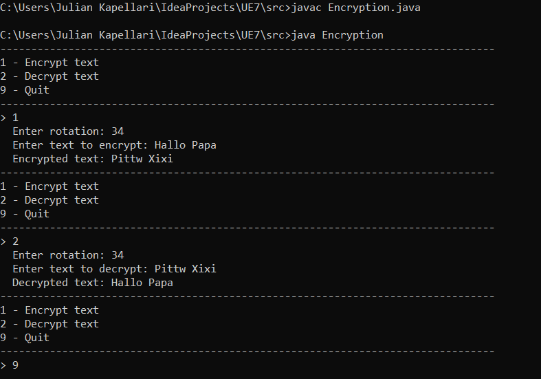

# Encryption

This aplication encrypts and decrypts text.

## Installation

You have to save the zip-file on your computer.

## How to run

Open the downloaded src directory and enter this code in the terminal.

```
javac encryption.java  
java encryption
```

## How to use

If you want to encrypt a text you have to press **1**. After that the software asks for a key, which will be added to every letters ASCII-number. Then the encrypted text will be printed to the console.  
To decrypt the text you have to press **2** and enter the same key as before. Again the decrypted text will be printed to the console.  
To close the software press **9**.

* 1 - Encrypt text  
* 2 - Decrypt text  
* 9 - Quit



## Author

***Kapellari Julian***

[GitHub](https://github.com/JulianKapellari06)

[FH](https://www.fh-joanneum.at/)

## License

**Free Software, Hell YEAH!**

## Excercises

[Exercise 1](exercise1.md)

[Exercise 2](exercise2.md)

[Exercise 3](exercise3.md)
