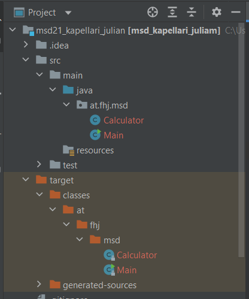
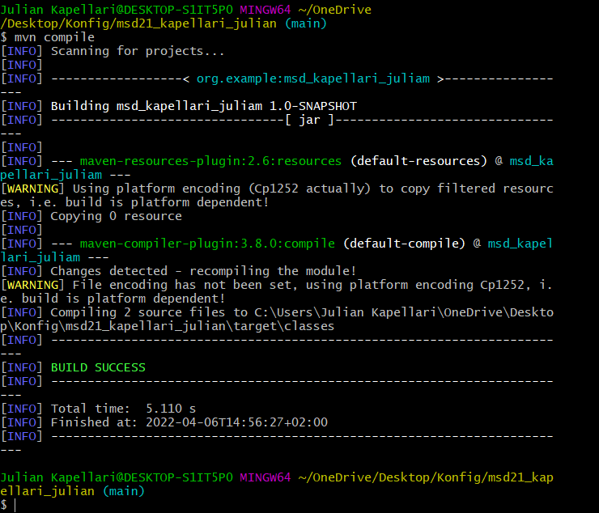
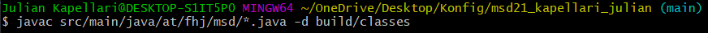
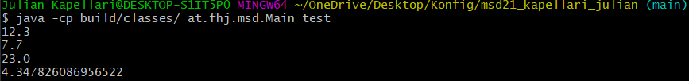
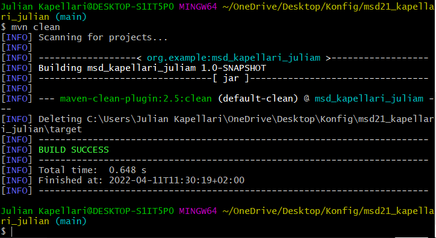

# Exercise 3

Der Zielordner ist der Standard-Ausgabeordner von Maven. Wenn ein Projekt gebaut  wird, wird der gesamte Inhalt der Quellen, Ressourcen und Webdateien in diesem Ordner abgelegt und für die Erstellung der Artefakte und für die Ausführung von Tests verwendet.

## Compile

## Run

## mvn Clean

Cleans Maven Project. (target directory removed)
We do not want to push auto generated files.

[Home](README-Kapellari-Julian.md)
