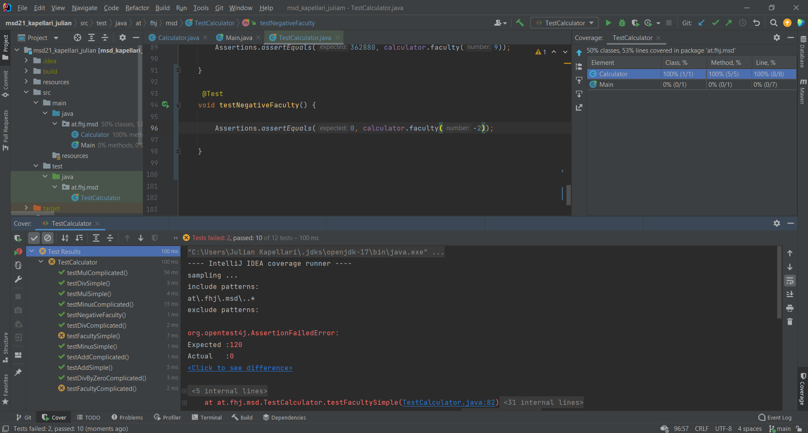
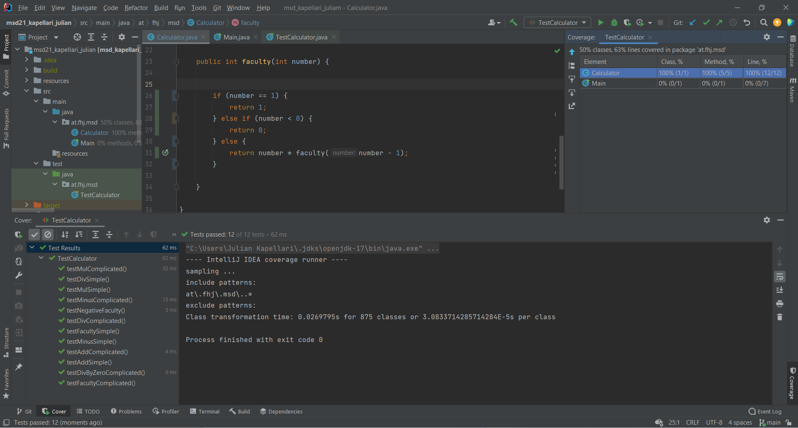

# Exercise 4

Every method is tested twice, except of the divide method. This one is tested three times because I added an Error Test. So I check wheter the methods throws an ArithmeticException because of division by zero or something else or not.

## Testcoverage 1

## Testcoverage 2

## Testcoverage 3

[Home](README.md)
